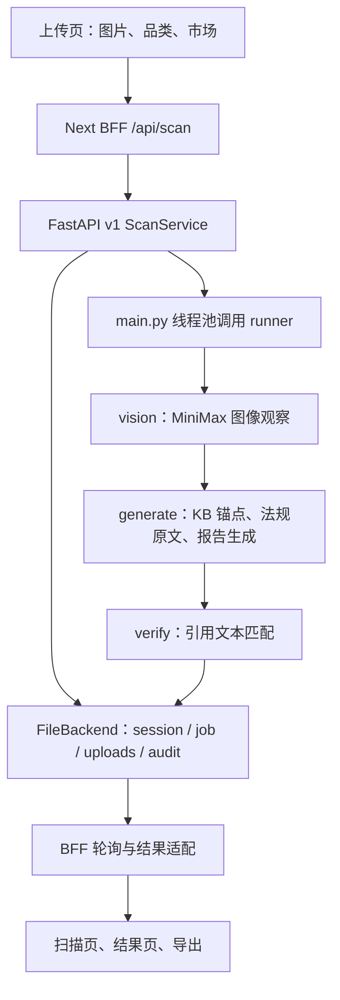

# Attrax 扫描进度、图像定位与结果可信度实施方案

核对日期：2026-09-13。基于本地 HEAD `154b057`、线上 `lighthouse:/opt/attrax`、截图对应的已保存真实会话及官方项目资料。本文是待实施方案；本轮没有修改业务代码、部署服务或重新调用模型扫描。

## 1. 建议交付的产品形态

第一版交付：**按品类逐项检查 → 展示真实阶段进度 → 在原图定位可观察的问题 → 点击框看证据与动作 → 引导补拍未覆盖区域。**

同时提供“局部悬浮放大”：从用户原图裁出真实区域，浮在原图旁边，用引线连接。第二版取得可靠的部件分割蒙版后，再做沿轮廓悬浮的 2.5D 效果。单张外观照片无法提供内部 PCB、电芯等被遮挡部件的真实形状，不能用生成式拆机图充当检测证据。

不要为了满足“圈出几个问题”固定产生三处红框。每个检查项必须有结果，但真实问题可以是零个；未覆盖、看不清、需要材料检测也是有价值的结果。

## 2. 本轮确认的现状

### 2.1 线上和本地

| 项目 | 本轮观察 |
| --- | --- |
| 本地工作区 | 检查时干净，HEAD 为 `154b057` |
| 生产运行位置 | Next：`/opt/attrax/.next/standalone/server.js`；FastAPI：`rag_service.main:app` |
| 运行服务 | `nextjs`、`rag-service`、`regwatch` 均 online；同机还有 portfolio |
| 健康检查 | 公网 `/api/health` 正常，`demoMode=false`；后端 `/ready` 正常，`pipeline=kb_anchored` |
| 构建标识 | 本地 `.next`、服务器 `.next` 和运行目录 `.next/standalone/.next` 的 BUILD_ID 均为 `h5zmjkAs3IxImQ5GDrDsd` |
| 关键源码对账 | `useScanPolling.ts`、`application/scans.py`、`nodes/vision.py`、`HotspotLayer.tsx` 四文件本地/服务器 SHA-256 相同 |
| 服务器资源 | 2 个 CPU、约 3.6 GiB 内存；磁盘约 26% 已用；未发现 `nvidia-smi` 命令 |
| 版本追溯缺口 | 目标会话 audit 的 `codeVersion` 为 `unknown` |

这是主链路与关键模块审查，不是逐文件安全审计。健康检查只说明服务当时可用；未做新的生产上传或浏览器全流程验收。服务器资源与关键哈希不代表全目录逐字节一致，也不能仅凭未安装 `nvidia-smi` 判定硬件绝对没有 GPU。

### 2.2 截图对应的真实任务

会话：`scan_11cd3b56a7244d348e5688c5db1e6838`。

- 创建：北京时间 19:02:37；完成：19:03:36；约 59.2 秒。
- 一张图片，品类 electronics，目标 EU / UK；终态 ready，结论 WARN / HIGH。
- 实际 `agentTrace`：视觉 5,513 ms；生成 53,645 ms；引用验证 6 条匹配、0 条未匹配。
- `decisionView.nodes` 有“视觉识别、查询规划、法规检索、证据合成、报告生成、一致性校验”六个过程节点；没有定位框。
- 节点内由模型写出的 0.2s、0.8s 等时长与真实 trace 不一致，不能拿来显示真实执行耗时。
- 利润文字说“待询价/待确认”，但 `structuredFields.costComparison` 是全零，finance 校验标记 valid。因此页面显示 $0 并非已有真实报价。

截图中的红框用于表达你期望的交互；不能据此认定外壳、品牌字样或反光位置存在真实缺陷。

### 2.3 已确认的问题与代码入口

| 优先级 | 问题与影响 | 代码入口 |
| --- | --- | --- |
| P0 | 后端只在开始写 10、完成写 100，缺失阶段事件 | `rag_service/application/scans.py:328`，`rag_service/pipeline/runner.py:126` |
| P0 | 前端动画被 `Math.max(realTarget, floor)` 限制，后端为 10 时永远不超过 10 | `lib/hooks/useScanPolling.ts:120` |
| P0 | 收到 ready 后直接跳转，未等待显示 100 | `app/burning/[sessionId]/page.tsx:144` |
| P0 | `decisionView.nodes` 全部转成风险点，“一致性校验”因此成为产品风险 | `lib/rag-client/v1-result-adapter.ts:195` |
| P0 | 风险证据完整度固定 85% | `app/result/[sessionId]/page.tsx:329` |
| P0 | 无来源的全零财务数据被当有效数值，文字与金额相互矛盾 | `rag_service/schemas/report_package.py:30` 及目标会话结构化结果 |
| P0 | 16 个前端市场与 BFF 的 8 个市场不一致；不支持的市场被静默过滤，全部过滤后会回退 EU/US | `lib/types.ts:1`，`app/upload/page.tsx:817`，`app/api/scan/route.ts:29` |
| P1 | 所有图片的可定位问题都画到当前图，缺 `imageId` 过滤 | `app/result/[sessionId]/page.tsx:134` |
| P1 | 原图在固定 4:3 容器里 `object-cover` 裁剪，框却直接按容器百分比定位 | `app/result/[sessionId]/page.tsx:339`，`components/result/HotspotLayer.tsx:126` |
| P1 | 框本身有 perspective/rotate/scale，改变与证据的对齐关系 | `components/result/HotspotLayer.tsx:140` |
| P1 | 无坐标的风险仍放在图片顶部；成本标签也使用固定位置，容易被误认为实际定位 | `app/result/[sessionId]/page.tsx:356`、`:397` |
| P1 | 加载页热点位置、风险等级、法规流由静态列表和百分比决定，并非真实发现 | `components/complipilot/scan-image-stage.tsx:25` |
| P1 | Vision Prompt 一边禁止法规结论，一边举“接口无 CE 标记”等问题例子，还允许模型填法规 ID，职责冲突 | `rag_service/pipeline/nodes/vision.py:33` |
| P1 | Vision 只输出自由问题列表，未绑定品类检查项；缺失区域和不清晰区域没有独立定位契约 | 同上 |
| P1 | 问题靠 label 包含关系粘到流程节点；多图重复 ID、同名问题覆盖坐标的风险存在 | `rag_service/pipeline/nodes/generator.py:204` |
| P1 | `buildRisks` 从已不再使用的 `retrievedChunks` 取法规；风险卡片可能拿不到 package 的真实引用 | `lib/rag-client/v1-result-adapter.ts:202` |
| P2 | 品类 TypeScript/上传 UI 已有十项，`ProductCategorySchema` 仍是六项，存在契约漂移 | `lib/types.ts:41`，`lib/schemas.ts:5` |
| P2 | 历史文档仍描述 LangGraph/FAISS/mimoTalk 与旧服务器地址 | `docs/PROJECT.md`、`docs/SERVER-VERSION.md` |

本轮执行现有轮询与状态接口测试：38 项通过；有 React act 警告。另按当前动画公式离线重放 60 秒，显示仍为 10。这说明已有测试通过不足以证明进度交互正确，需新增行为验收，而不是继续堆同构断言。

## 3. 现有架构与改造边界



保留 Next BFF、现有会话鉴权、KB 原文与引用验证链路。新增三个清晰的数据对象：

1. `observations`：图片看到了什么、在哪里、可见程度如何。
2. `findings`：哪个检查项有疑点/缺证据，依据哪些 observation 与法规。
3. `agentTrace`：工程记录的执行阶段、耗时、错误。只放“处理详情”，不转换成风险。

`decisionView` 只负责最终结论与摘要，引用 `findingIds`。旧结果没有 findings 时，展示历史报告和“此历史报告未保存结构化定位”；不要从流程节点补造问题，也不要自动重新扫描覆盖旧记录。

## 4. 进度：真实阶段驱动，阶段内平滑展示

### 4.1 阶段与建议区间

以下百分比是 UI 的初始阶段权重，不是实测吞吐比例。上线后按品类、图片数、模型的耗时分布校准。

| 阶段 | UI 区间 | 可以显示的真实内容 |
| --- | --- | --- |
| 上传 | 0–8 | 文件上传字节；拿不到上传字节事件时显示“不定进度”，不伪造精确百分比 |
| queued / preprocess | 8–12 | 已收图、排队、方向和清晰度检查 |
| vision | 12–30 | 已分析图片 1/3、已识别可见区域 |
| applicability | 30–36 | 品类与特征确认、检查清单与适用法规选择 |
| generate | 36–83 | 检查项分析与报告结构生成；模型长调用期间明确显示“正在分析” |
| verify | 83–93 | 已核对引用数、发现与证据关联校验 |
| persist / prepare | 93–98 | 保存报告、验证图像与框契约；准备页面 |
| completed | 100 | 后端结果持久化且核心结果可展示 |

没有实现某个细分阶段之前，不提前显示该阶段已完成。可先只上 `queued / vision / generate / verify / persist / complete` 六阶段，然后细化。

### 4.2 服务端契约

给状态响应增加明确字段，停止用 `stageText` 的英文关键词反推阶段：

```json
{
  "sessionId": "scan_example",
  "status": "processing",
  "stageKey": "generate",
  "stageState": "running",
  "stageStartedAt": "2026-09-13T11:02:44Z",
  "updatedAt": "2026-09-13T11:03:00Z",
  "progressFloor": 36,
  "progressCeiling": 83,
  "completedUnits": null,
  "totalUnits": null,
  "attempt": 1,
  "revision": 7,
  "resultVersion": null
}
```

在 runner 每个节点开始/结束触发回调；Vision 多图完成时触发图片计数。由 `main.py` 将线程内事件送回事件循环，再由 ScanService 更新持久状态。回调属于内部调用参数，不进入用户 JSON、不使用跨任务全局变量。

FileBackend 需提供受锁保护的 `update_session(sessionId, updater, expectedRevision)` 或等价机制，避免阶段更新、lease heartbeat 与完成写入互相覆盖。加入 attempt、job lease/fencing 标识与终态保护，阻止旧线程或过期重试把 completed/failed 改回 processing。不要只是给 `save_session` 增加一堆调用。

第一版继续 1–2 秒轮询即可；无需先引入 SSE 才能修好进度。后续可加 SSE：事件带递增 ID，断线先拉最新快照再续传，心跳、代理禁缓存/禁缓冲；仍保留轮询退路并复用现有 HttpOnly cookie 鉴权。SSE 本身不会让模型生成更快。

### 4.3 前端算法与结束门槛

```text
如果服务端有可信的 completedUnits / totalUnits：按单元进度映射阶段区间。
否则：在当前已确认阶段内按 elapsed 做渐近插值。
target = floor + (ceiling - floor - epsilon) × (1 - exp(-elapsed / tau))
display = max(previousDisplay, min(target, stageCeiling))
```

这个百分比是“阶段估计进度”，不是把 LLM 思考量伪装成可精确测量的百分比。到达阶段上限后显示已等待时间与实际状态，不继续跨入尚未开始的阶段。

- 后端没有 ready 与有效结果时，显示整数也最多 99，避免四舍五入提前显示 100。
- 收到 ready 后先校验并缓存 result，预加载主图；短动画补到 100，停留约 200–400ms，再 `router.replace`。补完动画建议 0.4–1.0 秒，不人为重演一分钟流程。
- 主图加载失败给出有限超时和明确提示，允许进入可读结果；不能无限卡在 99。可选 mask 生成不阻塞结果。
- 失败进入失败态；不沿用当前 `_mark_dead(progress=100)` 的成功视觉。错误、取消、retry_wait 分别显示。
- 短暂网络错误允许有限重试；404/401/410 与网络断开分开提示，网络异常不直接判定任务已失败。
- sessionId 变化重置 refs/计时；卸载取消 fetch 和 rAF；后台标签页恢复按时间重算，不能依赖帧数推进。
- `prefers-reduced-motion` 减少动画；页面仍能表达完成状态。
- 不再用静态 HOTSPOT_SLOTS 的“高危”和固定法规勾选装饰扫描过程；没有真实发现时只显示中性扫描效果。

## 5. 固定检查清单：品类 × 子类型 × 特征 × 市场

当前上传页有十类，不应全部套同一段 Prompt。规则由固定文件维护，模型负责观察和填写结果。现有 `data/kb/anchors/*.yaml` 已承担法规锚点，应继续复用；新增视觉检查清单，不把法律文本再复制一套。

建议新目录 `data/inspection_profiles/`：common、electronics、appliance、3c、toy、home、battery、cosmetic、textile、food_contact、other。这里的名字为拟新增文件，不代表已经存在。

下面是视觉检查范围建议，**不代表表中每项都是所有国家、所有产品的强制法律要求**。是否要求某个标志或测试，必须经过市场、产品子类、电压/容量、用途、时间等适用性判断。

| 品类 | 图片里固定观察的区域/字段 | 上传时优先引导的视角 | 单凭图片不能得出的结论 |
| --- | --- | --- | --- |
| 通用 common | 产品主体、品牌型号、铭牌/标签、批次与追溯字段、警告文字、包装信息、可见外观异常 | 正面、背面/底面、铭牌近照、包装 | 认证真实性、完整法规符合性 |
| electronics | 铭牌、电压/电流/功率文字、接口/插脚、线缆与接头、外壳可见裂损、可见标志区域 | 整体、参数标签、接口/插脚、外置适配器 | 电气安全、EMC、绝缘耐压、化学含量 |
| 3c | 设备与充电盒分别识别；各自铭牌、端口、标签、可见电池说明、无线声明 | 主设备、充电盒底面、端口、包装 | 充电盒是否含无线发射模块、隐藏电芯参数 |
| appliance | 铭牌、供电端、进出水/加热/通风区域、线缆、水位/温度警告、外壳可见异常 | 底面铭牌、供电端、功能区域、安全说明 | 防水等级、温升、漏电、内部结构安全 |
| toy | 年龄说明、警告语、可见小附件、磁体/绳带、电池仓闭合方式、可见尖锐或破损部位 | 玩具全景、附件平铺、包装年龄警告、电池仓 | 小零件量规通过与否、拉力、磁通量、迁移限值 |
| home | 产品用途与接触面、连接/承重部位、边缘、安装说明、警告标签、可见破损 | 全景、连接部位、标签、安装说明 | 承重/疲劳性能、阻燃等级、材料成分 |
| battery | 电池标签、型号、V/Ah/Wh/化学体系文字、端子、绝缘包覆、可见鼓胀/破损疑点 | 标签近照、端子、整体侧面、运输包装 | 实际容量、UN38.3 通过与否、内部短路或材料性能 |
| cosmetic | 容器与外盒的成分表、净含量、批号/日期、用途、使用方法、警告和责任主体文字 | 正反面标签、外盒各面、底部批次 | 配方合法性、污染/微生物、功效真实性 |
| textile | 纤维成分、洗护、尺码、追溯标签、绳带/附件、可见做工异常 | 全景、所有缝入标签、附件与绳带 | 实际纤维含量、色牢度、甲醛/偶氮、阻燃测试 |
| food_contact | 接触面、材质声明文字、温度/用途说明、涂层可见异常、产品标签 | 内壁/接触面、底部标签、包装用途说明 | 总迁移/特定迁移、重金属、实际耐热、食品接触安全 |
| other | 先应用通用检查；确认用途/人群/供电/接触类型后转具体 profile | 全景、标签、用途说明 | 不推断所有法规均适用或判定通过 |

建议先精做现有三个 Demo 对应的真实子类型：充电器、加湿器、玩具；增加耳机/充电盒作为本次回归样本。其余品类先交付完整的证据采集清单，按数据集评测逐类开放自动判断。

### 5.1 每个检查项必须有稳定 ID 与完成状态

```yaml
id: common.nameplate.readability
version: 1
title: 铭牌信息可读性
targetRegions: [nameplate, product_label]
requiredViews: [nameplate_closeup]
methods: [vision, ocr]
evidenceMode: visual
legalAnchorRefs: []
```

模型不能删掉它不会做的检查项。服务端对本次选中的 checkIds 做全集校验：未返回的项自动标记 `not_assessed`，不能视作通过。

将三个维度分开：

- 观察状态：`present_readable / present_unreadable / not_in_view / occluded / absent_in_visible_scope / not_assessed`。
- 适用性：`applicable / not_applicable / needs_confirmation`，附事实与规则版本。
- 最终判断：`no_issue_observed / suspected_issue / evidence_needed / confirmed_issue`。`no_issue_observed` 只说明该观察项未见异常，不能推出整品合规。

“材质有问题”必须改成可证实的描述，例如“接触面可见涂层剥落疑点”。材质化学限值不合格需要相应检测证据，不能从颜色和质感判断。

### 5.2 缺少标识如何标记

1. 看到完整标签区域、图像可读，但某个**已经确认适用**的字段未出现：可框标签区域，标注“此标签区域未检出该字段”。要进一步认定整品缺少，还需检查规则允许的其他标识位置与所有相关视角。
2. 标签存在但模糊/反光：黄框标签，标注“铭牌文字无法辨认，建议补拍”。
3. 只拍了正面，铭牌通常位于底面但底面未展示：`region=null`；在补拍区提示“补拍底面/铭牌”，不能在正面任意画框。
4. 缺证书、材质报告、说明书：放“待补资料”，可关联产品或可见部位作导航，但不得把导航框称为缺陷边界。

## 6. 数据结构：明确位置、证据与判断的关系

建议 `report-package/v2` 增量增加以下对象；先兼容读取 v1，再迁移展示。用 Pydantic 定义后端约束，通过 OpenAPI 生成 TS，再加 UI 使用的运行时 Zod 校验，避免四处手写枚举。

```ts
type ImageAssetV2 = {
  imageId: string;
  sha256: string;
  width: number;
  height: number;
  orientationApplied: boolean;
  canonicalVersion: string;
  viewType: string | null;
};

type Observation = {
  observationId: string;
  checkId: string;
  imageId: string;
  visibility: string;
  observedText: string | null;
  description: string;
  region: null | {
    kind: 'bbox' | 'polygon';
    coordinateSpace: 'normalized_canonical_image';
    bbox: { x: number; y: number; w: number; h: number };
    polygon?: Array<[number, number]>;
    groundingSource: 'vlm' | 'ocr' | 'detector' | 'human';
    confidence: number | null;
    verified: boolean;
  };
  maskAssetId?: string;
};

type Finding = {
  findingId: string;
  checkId: string;
  title: string;
  assessment: 'suspected_issue' | 'evidence_needed' | 'confirmed_issue';
  applicability: 'applicable' | 'not_applicable' | 'needs_confirmation';
  severity: 'critical' | 'high' | 'medium' | 'low' | 'unknown';
  observationIds: string[];
  citationIds: string[];
  suggestedAction: string;
  requiredEvidence: string[];
};
```

工程约束：

- 一个 finding 可关联多张图片、多条 observation；不再用一段 label 做字符串模糊匹配。
- ID 至少带本次扫描与图片的身份，不能每张图从 `vision-issue-0` 重复编号。
- region 为空是有效状态；不使用 `{x:0,y:0,w:0,h:0}` 哨兵冒充真实框。
- 坐标必须有限、在范围内、宽高大于零、`x+w<=1`、`y+h<=1`；明显越界拒收并记录原因。仅处理数值舍入级别误差，不把严重错误静默裁成“合法框”。
- 验证 imageId 存在、模型使用的 image hash/尺寸对应；保存模型和 Prompt/profile 版本。
- `confidence` 区分定位、OCR 与判断置信度；模型自报 0.9 不是已经校准的准确率。无可信数值时显示“不确定”，不补 95%。
- risk → citationIds → package.citations/evidencePack；引用匹配率、视觉覆盖率与风险严重度分别展示。
- v2 持久化核心结构，页面、PDF/Word、整改清单均由同一份 findings 生成；模型 markdown 作为解释正文，不能各处再独立推导一套事实。

## 7. 模型调用与坐标校验

### 7.1 推荐第一版

沿用现有 MiniMax 作为基线，先扩展输出契约并评测坐标质量；不因“支持图像输入”直接假定它擅长精确定位。

处理顺序：

1. 解码并校验图像，统一 EXIF 方向，保留原件并生成 canonical image；记录尺寸/hash。检测模糊、反光和是否完整入镜。
2. 用户选择品类时直接带入 profile；模型只建议子类型。冲突或关键特征不明时记录 needs_confirmation。
3. 每张图执行“全部指定检查项的观察＋区域定位”；模型只返回 observation，不输出随意法规 ID、价格或流程节点。
4. 对铭牌、细字警告等区域按需裁剪，做 OCR/第二次局部识别；将局部坐标按裁剪变换映射回 canonical image。
5. 应用固定规则与知识库判断适用性；生成 findings 和 citationIds。
6. 校验坐标、证据关系、引用、适用性条件和结果完整性，再持久化。

不要无条件把每张图都多调三个模型。清晰、位置明确的样本走一次观察；局部复核只针对低清晰度/低可信定位/高影响疑点。第一版先限定图片并发与单任务追加调用预算，记录真实耗时和费用，再调优。

### 7.2 可复用的 GitHub 方案

| 方案 | 在项目里的具体用途 | 选择建议与边界 |
| --- | --- | --- |
| [Qwen3-VL 2D grounding cookbook](https://github.com/QwenLM/Qwen3-VL/blob/main/cookbooks/2d_grounding.ipynb) | 语义描述到区域定位，作为 VLM 坐标质量对照 | 与当前 MiniMax 在同一批商品图上比较；坐标制由 provider adapter 显式转换，不混用像素与归一化坐标 |
| [PaddleOCR](https://github.com/PaddlePaddle/PaddleOCR) | 铭牌、参数、成分、警告等文字及位置提取 | 优先补这一类能力；OCR 找到“CE”等文字不等于验证标志真伪或认证有效 |
| [GroundingDINO](https://github.com/IDEA-Research/GroundingDINO) | 用“label / charging port / battery compartment”等文本找可见部件框 | 可做定位候选，输出框仍需小目标评测；不负责判断缺失物体与法规适用性 |
| [SAM 2](https://github.com/facebookresearch/sam2) | 根据可靠点/框取得物体轮廓蒙版 | 第二版用于真实局部抠图悬浮；无法从蒙版推断内部零件。官方仓库说明模型及主要代码为 Apache 2.0 |
| [Grounded-SAM-2](https://github.com/IDEA-Research/Grounded-SAM-2) | 参考“文本定位 → 分割 → 导出 JSON”的整合链路 | 最贴近后续部件悬浮需求，但不是可直接上线的合规判断引擎 |
| [SAM 3](https://github.com/facebookresearch/sam3) | 后续评估文本概念分割 | 纳入候选比较，不因版本更新就替换；部署要求与权重许可按具体版本另行核对 |

以上是本轮查阅的官方仓库能力，不是已在 Attrax 运行过的性能结论。官方 grounding 示例也不证明在弧面铭牌、反光塑料或极小标志上的准确率。

当前 2 核小内存主机优先承担 BFF、任务编排与轻量后处理。建议先用现有远程 VLM；OCR 单独限资源或使用独立服务；重型检测/分割放独立 GPU worker 或受控远端推理服务。没有必要为第一版框选把整站迁上 GPU。

## 8. 图像展示：先准确框，再悬浮真实局部

### 8.1 坐标系必须统一

最容易稳定的做法是让画布比例等于 canonical image 的 `width / height`，底图与 SVG overlay 共享 `viewBox="0 0 W H"`。二者一起缩放、平移；只有图片对应的 findings 进入 overlay。

若使用固定大小容器＋object-contain：

```text
s = min(containerWidth / imageWidth, containerHeight / imageHeight)
offsetX = (containerWidth - imageWidth × s) / 2
offsetY = (containerHeight - imageHeight × s) / 2
left   = offsetX + bbox.x × imageWidth × s
top    = offsetY + bbox.y × imageHeight × s
width  = bbox.w × imageWidth × s
height = bbox.h × imageHeight × s
```

如坚持 object-cover，则 s 改为 max，还需处理裁剪与不可见区域。但检查证据应能看完整原图，建议直接采用前一种方案。

### 8.2 三档视觉能力

| 档位 | 实现 | 能证明什么 |
| --- | --- | --- |
| A：框选 | SVG 矩形/多边形、编号、文字标签、点击联动；选中时其他框弱化 | 此观察与原图这个区域关联 |
| B：局部悬浮 | 复制原图的真实 crop，放大后 translate/阴影，细线连接原始框；标“局部放大” | 悬浮卡片内容确实来自该照片 |
| C：轮廓悬浮 | 部件 bbox → SAM mask → 透明裁片 → 分层 translateZ / 少量 rotate；保留原图位置轮廓 | 可见部件的图像分离效果；不是实际机械拆解 |

第一版交付 A+B。B 不需要分割模型，用现有 CSS/Framer Motion 即可实现，对阅读铭牌特别有效。

原图上的定位框保持平直，不对 bbox 自身做倾斜/scale。2.5D 动效只加在复制的局部图卡上，避免把证据框挪离真实位置。无坐标项集中显示在侧栏“待补拍 / 待补资料”，不要在图上排队摆点。

桌面：左图右卡片；移动端：完整图片上方或首屏，问题列表/底部抽屉；支持点击编号、键盘焦点、颜色之外的文字/图标。标签避让与边缘吸附使用引线，避免把标签移走后连指向都丢失。

结果首屏顺序建议：结论和证据状态 → 原图＋问题 → 每个问题的补拍/整改动作 → 检查清单 → 报告与成本。流程 trace 放折叠详情，金额没有依据时不占主要视觉位置。

## 9. 本次耳机图片的目标结果

依据现有保存的观察，照片主要显示外壳、铰链/缝隙、指示灯孔与品牌字样。没有充分证据证明截图红框内就是缺陷。

应展示类似下面的内容，最终以重新运行新视觉流程为准：

- **铭牌与产品参数：待补拍。** 当前图未覆盖完整铭牌，定位为空；引导拍底部/背面。
- **品牌区域：已观察。** 如果新定位可靠，可提供区域框作为导航，不标红、不算问题。
- **标识可读性：当前视角无法验证。** 不能从前面没看到 CE/UKCA 推出整品缺少。
- **材质安全：待资料。** 需要材质声明或适用的检测报告；外观照片不能判断 RoHS/REACH 是否通过。
- **无线适用性：待确认。** “无线耳机充电盒”名称不能证明盒子本身含无线发射模块；区分耳机和盒子的产品主体。

如果新模型只识别出两个需要补证据的项，就显示两个；没有可定位的真实疑点就不画红框。

## 10. 应同时优化的结果可靠性与性能

### 10.1 引用正确，不代表适用性正确

当前样本 6/6 引用匹配，但生成的成本解释把“电池护照”等概括成不可省略项。应增加 `applicability`、`effectiveFrom`、`productConditions`、`assessmentDate` 和证据来源；未知条件不能直接转为强制整改。

具体反例：欧盟电池法规 Article 77 的电池护照适用对象是 LMT、电动车电池及容量大于 2 kWh 的工业电池，起始日期为 2027-02-18。不能仅因耳机充电盒含电池，就判定它需要 Article 77 电池护照。[欧盟委员会 2026-08-21 官方说明](https://single-market-economy.ec.europa.eu/news/guidance-support-preparations-digital-batteries-passport-2026-08-21_en)

英国也不能简单写“缺 UKCA 就不合规”：GB 无线设备官方指南允许相应条件下用 CE 或 UKCA，且 GB 与北爱尔兰应分开建模。[英国无线设备官方指南](https://www.gov.uk/government/publications/radio-equipment-regulations-2017/radio-equipment-regulations-2017-great-britain)

这两例用于说明产品规则引擎需要校验什么，不构成该产品完整合规结论。现有 `detect_features` 的关键词只作为候选特征，不能把名称里的“无线”、文本里的“无电池”直接变成已确认硬件事实。

### 10.2 把未知数值保留为未知

- 财务字段改为 `{value: number|null, status, sourceRefs, currency, unit, asOf}`；无来源时显示“待询价”，不显示 $0。
- 零值只有在来源明确支持时才有效；不要通过“所有零都禁止”的粗糙规则误伤真实免费项目。
- 当前财务校验主要保证数字非负和恒等式，不能识别“模型把未知填零”。补来源校验与跨正文一致性校验。
- `gp` 等利润字段应允许亏损的负值，成本字段仍可非负；不要为了通过 schema 将亏损抹平。
- 证据完整度改成可解释计数，如“适用检查项 12，已取得所需证据 7，待补 5”。计算规则固定版本；适用性未知另列，不能从分母静默排除后提高比例。
- 不把“无发现”“引用全部匹配”“工程运行成功”翻译成“100% 合规”。当前 severity→35/65/90 的分数是启发式映射，应明示口径或先隐藏精确分数。

### 10.3 降低真实等待时间

当前个案约 91% 时间用于 generate，优先优化这一段；这是单样本占比，不是线上 p95。

建议：只让模型生成一份精简的事实与 findings JSON，再用程序渲染合规正文、问题卡与整改列表；避免模型重复编写同一结论的多个场景、双语文案和虚构流程节点。用户选择中文就先生成中文，另一语言可按需生成并复用同一事实 ID。

按需生成详细利润报告；未提供成本输入时直接给出确定性的待补材料清单。对引用正文做与本次检查项相关的选择，保留原文定位；不能为了缩短 Prompt 把来源截断后仍声称完整引用。

缓存分层：图像观察按 canonical hash＋模型＋Prompt/profile 版本；法规与适用性按目标市场＋assessmentDate＋KB 版本；报告缓存按所有输入版本。跨会话复用需保持授权隔离，不能把用户图片暴露给其他会话。只复用匹配的阶段，不以错误品类或过期规则命中旧报告。

### 10.4 运维与回归

- 保留当前单机 FileBackend，先实现原子状态更新、幂等和版本记录；多机扩容时再迁事务数据库/队列。
- 统一扫描总 deadline、模型调用 deadline、重试预算；现有前端最多 300 秒、后端单次 280 秒并不自动覆盖多次重试。前端等待超时可以继续后台任务，但必须告诉用户如何恢复，不偷偷再发一轮。
- 限制任务并发和排队长度。Python 的 executor 超时不一定停止底层线程，需要明确取消/迟到结果丢弃策略。
- 发布写入 `ATTRAX_BUILD_SHA`，每个结果保存 schema/profile/KB/model/Prompt 版本；同一报告不能混用 watchdog 更新前后的法规快照。
- standalone、static、public、Python 代码与契约按同一个 release 对账；做可回滚版本发布。此次日志尾部可见 Next NoFallbackError，但未关联到本会话，不据此断言为当前问题根因。
- 观测 queue wait、stage latency p50/p95、有效结果率、重试原因、定位拒收率、低可见度率和模型费用。不要把历史 63 completed / 64 started 当长期稳定性证明。
- 旧文档标成历史，新增当前架构入口，避免下一位开发者继续沿已移除的 LangGraph/FAISS 修改。

## 11. 分批实施清单

时间是单人熟悉代码情况下的初步工程估计，不含训练、标注外包或模型服务采购。先验收每批，再决定是否进入下一批。

| 批次 | 内容 | 主要改动位置 | 预计量级 |
| --- | --- | --- | --- |
| A：修正当前误导 | 阶段事件、平滑进度、100 后跳转；停止流程节点变风险、固定热点/85%/未知金额；市场输入不静默替换 | ScanService/domain/runner/main、状态 BFF、useScanPolling、burning、result adapter/page | 2–4 人日 |
| B：视觉检查闭环 | 十类检查清单骨架；四个优先子类型细化；observations/findings v2；坐标校验与补拍逻辑 | inspection_profiles、新 schema、vision、generator/verifier、OpenAPI/TS | 4–7 人日 |
| C：可用的定位体验 | 原图正确比例、按图片过滤、SVG 框、多图导航、局部悬浮、导出一致 | Image/Hotspot 组件、result page、report exports | 2–4 人日 |
| D：语义与性能 | 适用性规则、财务来源、精简生成、缓存与追加局部 OCR、可观测性 | KB/适用性模块、generator、finance validator、任务服务 | 3–6 人日 |
| E：2.5D 增强 | 分割模型评测、独立 worker、蒙版后处理、轮廓悬浮、bbox fallback | 新 segmentation 服务、asset 存储、前端分层展示 | 3–7 人日以上，取决于评测结果 |

可先上 A，B 与 C 在共同契约确认后衔接交付。A+B+C 约 8–15 人日形成可用第一版；模型准确率不达标时，保留框/补拍体验，不能靠动画绕过。

拟新增模块建议：

```text
data/inspection_profiles/*.yaml
rag_service/schemas/visual_inspection.py
rag_service/application/scan_progress.py
rag_service/pipeline/nodes/visual_checks.py
rag_service/verify/grounding.py
rag_service/verify/applicability.py
lib/inspection/image-coordinate.ts
components/result/InspectionCanvas.tsx
components/result/FindingPanel.tsx
components/result/EvidenceRequestPanel.tsx
components/result/FloatingEvidenceCrop.tsx
```

现有 `HotspotLayer` 可以重构复用，不必引入完整 Canvas/3D 框架。将当前超长 result page 拆成上述职责组件，状态统一为 activeImageId / activeFindingId / viewMode。

## 12. 验收：如何证明这一版真的做对了

### 12.1 进度行为

- 用“视觉 5.5 秒、生成 53.6 秒”的本次时序作为回放案例：持续显示正确阶段，阶段内渐进，完成显示 100 后再进入结果。
- 覆盖快速完成、超过一分钟、首次请求即 ready、重试、失败、网络短断、刷新恢复、切换 session、后台标签页和 reduced motion。
- 不允许未完成显示 100、不允许 ready 后先跳页再补动画、不允许旧 attempt 覆盖终态。
- rAF 精确数值不是验收重点；关键是用户看到的状态、单调性、终态门槛和可恢复性。

### 12.2 定位与语义

- 建议初始标注集 100–150 张：充电器/加湿器/玩具/耳机盒各约 20–30 张，加极端比例、旋转、反光、遮挡、多图等场景；另留独立验证集，不在验收集上反复调 Prompt。
- 人工标注 checkId、可见性、位置、是否有问题、需要哪些补拍；不能只标有问题的正样本。
- 初始发布门槛建议：自动显示框的定位 precision ≥95%（以专家框 IoU≥0.5 等预先定义标准判定，细小/细长文字区域另评）；同时报告定位 recall/abstention，防止靠不出框刷精度。
- 所有出框项 imageId 必须 100% 正确；无可见目标不得伪造 bbox；关键事实/缺失认定在验收集内不得出现无依据的确定性宣称。
- 这些是拟定验收目标，尚未实测达到；按样本数量报告不确定性，不能外推所有品类。
- 用真实目标照片回归：旧流程的“一致性校验”不得再作为风险；底面未拍不得在正面圈出“缺铭牌”。

### 12.3 几何、浏览器与交付

- 原图比例、横竖图、EXIF 方向、contain 留白、缩放/平移、屏幕旋转、移动端、图边缘框、多图同名问题均需视觉验收。
- crop/mask 与原图使用相同 hash/坐标变换；点击列表、图框、缩略图后，图片与详情保持一致。
- 页面与导出报告使用同一个 findingId/observationId，数量和证据不发生变化。
- 部署后通过公网真实上传至少一组可定位样本、一组需补拍样本、一组多图样本，保留请求结果、阶段日志、最终 JSON、浏览器录屏/截图、代码与模型版本。
- Demo 测试、mock API、单元测试、生产 API E2E、浏览器 E2E 单独记录。现有 E2E 允许 source 为 real/fallback/demo，生产验收应明确要求 real，并检查 findings 与图像，不再只检查“有数字分数”。

第一版完成的标志：用户能看到真实处理阶段，结果页能指出有依据的问题位置，无法判断的项能给出具体补拍或资料要求，所有展示与导出都能追溯到同一份事实和来源。
