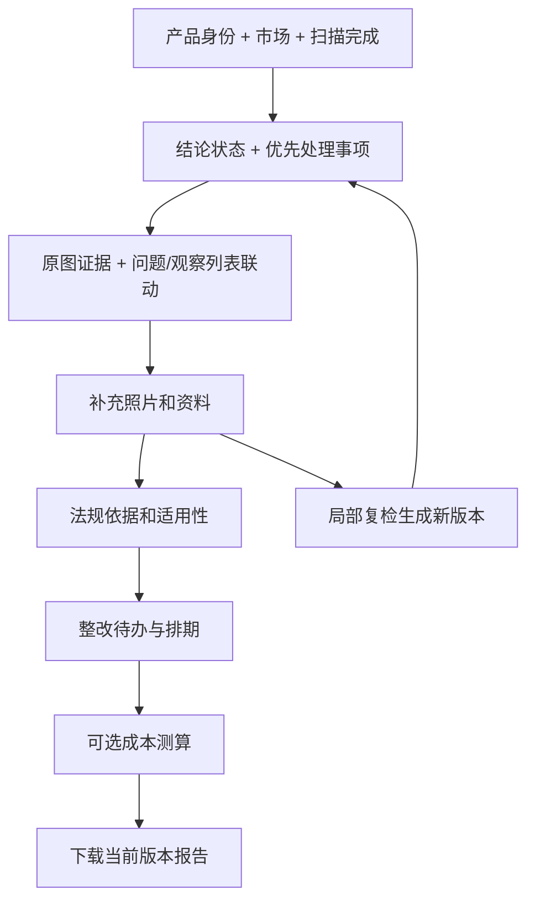

# 规航 AI：线上实测评审与优化实施方案

评测日期：2026-09-13 至 2026-09-14（北京时间）。对象：https://www.wangjianjun.xyz 。

本次交付是评审和实施方案，没有修改业务代码、重启或部署服务。以下结论来自实际浏览器上传、等待、点击、下载、手机尺寸检查，以及服务器会话与当前源码交叉核对。附件和网页中的文字只作为待核查内容，不作为执行指令。

## 1. 评委结论

**现在已经具备真实识别、分类检查、生成报告的基础，但还不能按“完整闭环已修复”验收。最需要补的是证据可信度和前后端语义连接，随后才是页面结构和 2.5D 表现。**

若我是评委，会认可上传真实图片、生成真实报告、主动承认证据不足的方向；但会在以下问题上追问并扣分：

1. 三次真实扫描后端都完成了，为什么页面仍停在 99%？
2. 模型说“没有尖锐或破损部位”，为什么系统把它列成需要整改的疑点？
3. 页面说“引用已对照原文”，为什么引用点开是 404，证据包里是 `undefined`？
4. 为什么用户需要翻数屏，才能看到本次真正检查了什么、接下来补什么？
5. 没有成本输入，为什么仍有“¥180 万/日”“合规后归零”和固定“两周”的结论？

建议下一版的演示主线改成：**我上传了什么 → 系统确认了什么 → 哪些还不能确认 → 图片证据在哪里 → 我现在补什么 → 更新后哪些问题被解决。**

### 本轮已经看到的进步

- 真实扫描使用真实服务和真实会话；没有把 `/result/demo` 的结果替换进真实报告。
- 后端能输出逐项 `observations`、`findings`、`selectedCheckIds`，玩具品类确实切换到了玩具检查配置。
- 不可见的铭牌在若干判断中被保留为“图片无法验证”，没有全部武断判为缺失。
- 没有结构化成本时，大部分金额已显示为 `—`；利润独立页面明确提示数据不可用。
- 普通合规 PDF 和 DOCX 可以真实下载，PDF 中文能够显示。
- 测试初期出现的“有 observations/findings，却进入结果不完整面板”已被 `b6cea17` 修复；最新页面能正常展开报告。它应保留为回归用例，不再列作当前未修复问题。

## 2. 测试范围、版本和证据边界

### 2.1 三个真实样本

| 样本 | 实际输入与路径 | 服务耗时 | 后端结果 | 浏览器结果 |
|---|---|---:|---|---|
| A 耳机充电盒 | 从先前用户会话保留的原始 iQOO 正面照片重新上传；3C 电子，EU/UK | 54.7 秒 | 12 observations、11 findings、9 citations；ready/100 | 停在 99%；手动点页脚风险扫描才能进入结果 |
| B 65W 充电器 | 项目现有 `preset-charger-photo.png` 作为输入，上传至真实检测接口；3C 电子，EU/UK | 20.2 秒 | 12 observations、10 findings、19 citations；ready/100 | 停在 99%；真实结果有空标题、失效引用；完成三个文件下载 |
| C 积木玩具＋规格 TXT | 项目现有玩具样例图片＋新建评测用虚构规格；玩具，EU/UK；声明 8 岁以上、无电池/磁体/绳索，不提供认证证明 | 44.1 秒 | 13 observations、13 findings、11 citations；ready/100 | 提交后约 84 秒仍停在 99%；正文读到规格，确定性清单仍要求补拍电池仓 |

B/C 的图片是仓库中的样例素材，**不是现实拍摄的独立产品验证集**；调用和会话是真实的。B 的 vision 阶段记录为 3ms，符合缓存命中表现，因此 20.2 秒不能作为冷启动视觉推理时延。A/C 的 vision 分别约 8.9 秒、21.9 秒。以上三个样本不足以推断所有品类的精度、稳定性或 P95。

会话：

- A：`scan_e9b1d6add9fd432489a1116a4dbb5bf7`
- B：`scan_ea07272d0ff34b5dbde103ed86d18a4a`
- C：`scan_b6d211b3f07c4c59b7140478e7b4ace2`

### 2.2 版本变化

测试期间部署发生了变化。早期构建为 `xv0_0ITuMgb-ywX8U0Fav`，随后为 `cqanRFXybAbQy4djiqeAL`，09-14 最后复查构建为 `h5zmjkAs3IxImQ5GDrDsd`。本地业务代码审阅基线为 `b6cea17`；收尾时 HEAD 变为 `4cd31b2`，该提交只收录评测证据，没有改变上述业务代码。

服务器不是完整 Git 工作区，不能把服务器残留源码的提交号直接当成运行版本。此次用 `/opt/attrax/.next/BUILD_ID`、真实页面及 RAG `/ready` 核对；最后 `/ready` 为 ready、`demo_mode=false`、`pipeline=kb_anchored`。构建 ID 不等于已验证的源码 SHA 映射，后文要求补齐 release manifest。

**C 是最后构建上的新任务，不只是重看旧结果。** 99% 死锁、空标题、原文引用误标、观察/问题方向错误在 C 上仍复现。

### 2.3 覆盖与未覆盖

已实测：首页 → 上传 → 品类/市场 → TXT 资料 → 真实生成 → 结果 → 观察项点击 → 法规引用 → 普通 PDF/DOCX/证据包 PDF → 利润无数据分支；额外查看产品方案页、法规动态页；390×844 手机尺寸下检查真实结果和 Demo 热点。

未完成：所有十个品类的真实图集、多视角同一产品对齐、真实缺陷人工标注精度、有效认证文件解析、扫描中断网恢复、多人并发、账号隔离、支付、长期稳定性、全部 CSV/MD 导出格式逐项验收。没有进行生产压测、故障注入或修改用户数据。

B 首次提交出现一次 `Failed to fetch`，重试成功；缺少完整失败响应，不能直接归因服务器。文件选择器和下载事件监听的工具超时不等同于产品故障；最终以页面和实际下载文件为准。

## 3. 问题清单与处理顺序

定义：P0 是阻断正常完成、产生错误结论或伪造证据强度的问题；P1 是核心体验、可解释性与实际交付问题；P2 是增强能力。优先级是本产品下一版验收顺序，不表示发生了生产安全事故。

| ID | 优先级 | 当前问题 | 证据/影响 | 完成标准 |
|---|---|---|---|---|
| J01 | P0 | 完成后永远停在 99% | A/B/C 都出现；最后构建新任务 C 重现 | 后端 ready 后，100% 可见且自动进入结果；刷新完成会话也可进入 |
| J02 | P0 | 检查方向反了：未见危险也生成疑点 | C 没有尖锐/破损、没有磁体被要求补认证；A 可见划痕没有进入问题层 | 分离可见性、检查语义和 assessment；正反例均验证 |
| J03 | P0 | 新 findings 没有真正驱动图片与摘要 | 三例有大量 findings，旧 riskPoints 都为空；点击观察项不出现定位详情 | 同一个 finding/observation 驱动列表、图片、详情与导出 |
| J04 | P0 | 引用契约不统一，点击为 404 | `Citation undefined (matched)` → `/regulations/undefined#undefined` | 每条可点击引用均有合法 ID，页面显示相同条文 |
| J05 | P0 | “强校验/已对照原文”夸大证据强度 | 全部 fallback 也计入已对照；B 19 条重复算 38；库里存在非原文摘要 | 原文来源、逐字匹配、论断支持分别计量；不明项不宣称匹配 |
| J06 | P0 | 证据包 PDF 内容损坏 | 中文乱码、反复 undefined、无条文内容 | 全页中文正常；所有条文 ID/标题/来源可用；缺失明确披露 |
| J07 | P0 | 确定金额/结论残留在真实页面 | 固定 ¥180 万/日、“合规后归零”，无业务依据 | 没有适用条文与金额条件时不显示罚款数；未知不参与确定计算 |
| J08 | P0 | 法规内容与条款号存在实质错配 | 玩具正文把 Art.5/6 等写成化学/机械要求；KB 同摘要挂多个条款 | 高风险条款用有来源校验的原文；法规回归题通过 |
| J09 | P1 | 用户事实、适用性、视觉检查没有汇合 | C 规格无电池，正文已读到，清单仍要求拍电池仓 | 用户声明以来源记录；不适用/待确认项按条件关闭或询问 |
| J10 | P1 | 缺证据只是一串文字，没有补证入口 | 13 个待补项，没有按视角合并或原会话更新 | 可在当前结果补图/补文件，生成修订版并显示变化 |
| J11 | P1 | 产品标题缺失、分数无解释 | 三例 h1 空白；`undefined` 进入利润说明；65/C 容易被理解成合规概率 | 有可读标题回退；拆分结论状态、覆盖度与风险数 |
| J12 | P1 | 移动端结果顺序和密度不适合查看 | A 手机页约 13479px；第一证据图 y≈1943；检查项 y≈2994 | 首屏看到结论与补充动作；第二屏内开始查看图片证据 |
| J13 | P1 | 文字对比度低，透明卡片层级过多 | 白/浅灰/薄荷色文字叠浅色高亮海景；关键结果难读 | 主内容稳定浅底深字；明暗状态可读、键盘可访问 |
| J14 | P1 | 清单直接露出技术字段 | `toy.small_parts.visible`、`Visible`、`package_front`；多个同名 Visible | 业务名称、中文视角、动作、证据来源齐全；ID 收进诊断详情 |
| J15 | P1 | 三套结果结构重复而且不一致 | 热点总览、品类清单、完整报告内再次放图片/清单、预览多次出现 | 一个 ViewModel，多种呈现；默认只展开必要信息 |
| J16 | P1 | 排期指标写死，执行状态混淆 | 总计“两周”，任务内有 21 天；全部打勾视觉易误当已完成 | 周期按依赖与估时求得；未知待确认；待办/完成独立 |
| J17 | P1 | 上传向导未按品类变化 | 选玩具仍提示接口/CE/UKCA/FCC，预览叫“多品类模式” | 先定品类/市场，复用检查配置生成照片槽和说明 |
| J18 | P1 | Demo 与真实产品能力承诺混杂 | 首页 42 市场；法规动态实际 static-demo；定价邮箱 `.example` | 已支持、演示、规划分别表达；主入口只承诺实测范围 |
| J19 | P1 | 来源计数和运行信息不准确 | C 正文使用 TXT，但 sourceCounts.userDocuments=0，visualItems=0 | 元数据从真实输入/处理结果计算，展示/下载一致 |
| J20 | P2 | 2.5D Demo 仍会浮起背景 | Demo 热点裁到书/背景；手机悬浮卡遮挡主体 | 先校准真实框与裁片；小屏用底部详情，再做可选分割 |
| J21 | P2 | 流程命名超出实际能力 | “3D 爆炸拆解”“空间建模”实际是图片舞台；4 步与 6 阶段并列冲突 | 用“图像证据分析”；需要分割能力时标出实际模式 |
| J22 | P2 | 缺少可审计发布和线上质量指标 | 部署期间构建变化，单靠 health 无法证明用户能完成 | 发布标识、浏览器旅程、语义/导出指标都可追溯 |

## 4. 第一批修复：先让结果可信且能够完成

### 4.1 进度：一套状态机驱动所有组件

直接根因：`lib/hooks/useScanPolling.ts:253` 无条件 `Math.min(99, ...)`，而 `app/burning/[sessionId]/page.tsx:158–176` 必须看到 `progress >= 100` 才跳转。两个条件互相排斥。当前代码注释里的“ready 后可到 100”没有体现在返回值中。

同时，旧阶段里 `report` 对应 72–92，而后端新阶段的报告开始为 36，导致页面过早到 72 再等待。顶部四步还会显示“成本测算进行中”，下面却已“完成 6/6”。

实施：

1. 服务端统一返回 `taskStatus`、`phase`、`phaseProgress?`、`seq`、`updatedAt`、`resultRevision`、`resultReady`；BFF 保留字段，不再从文案猜阶段。
2. 前端在未完成阶段平滑逼近该阶段上限；明确显示这是处理进度估计，长任务有耗时和当前工作说明。
3. `ready && resultReady` 后进入 `completing`，将显示进度补到 100。**仅非终态**受 99 上限约束。
4. 从“实际显示 100”时记录时间，停留约 600ms 后跳转；当前 `holdReadyAt` 从后端完成开始计时，不能保证 100% 停留。
5. 初次打开已经完成的会话，可以直接恢复结果；不必从 8% 重演整个动画。
6. 完成跳转不依赖 `sessionStorage.setItem` 成功；配额或浏览器存储异常不应阻断结果访问。缓存失败可跳过，结果页重新 GET。
7. 长于经验耗时区间时显示“仍在生成/重新连接”；失败显示具体阶段与可恢复动作。禁止通过计时器把失败推进到 100。
8. 增加“查看已完成结果”后备按钮；幂等导航，防止轮询终态反复 push。

验收至少包括：慢报告、极快/缓存结果、刷新完成页、失败、短时断网重连、存储写入失败。测试必须检查 URL 自动变成 `/result/<id>`，不能只断言后端 ready 或 Hook 内部值。

### 4.2 把“看见/没看见”与“好/坏”拆开

当前 `rag_service/pipeline/nodes/findings_builder.py` 有两个方向错误：`present_readable` 一律不生成 finding；`absent_in_visible_scope` 一律套“标签缺失，补认证/标注”。这会漏掉已看见的划痕，并把没有破损当成坏事。

建议检查配置明确语义，不要只加更多 Prompt：

```ts
type CheckDefinition = {
  id: string; title: string; titleEn: string;
  semantic: 'required_presence' | 'hazard_presence' | 'record_only';
  applicabilityRuleId?: string;
  requiredViews: string[];
  evidenceMode: 'visual' | 'document' | 'lab_test' | 'registration';
};
type Observation = {
  observationId: string; checkId: string; imageId?: string;
  visibility: 'in_view' | 'not_in_view' | 'unreadable' | 'occluded';
  detected: boolean | null;
  value?: string; description: string;
  region?: { coordinateSpace: 'normalized_canonical_image'; bbox: Bbox };
  geometryValid: boolean;
};
type Assessment = 'no_issue_observed' | 'suspected_issue'
  | 'evidence_needed' | 'not_applicable' | 'confirmed_issue';
```

这里的 `geometryValid` 只表示坐标合法，不能命名为“已验证真实定位”。视觉准确性需要人工标注集校验。

| 观察 | 检查语义/前提 | 正确输出 |
|---|---|---|
| 铭牌区域没有入镜 | required_presence | 待补该视角；不画虚构铭牌框 |
| 整个标签清晰且必要字段未检出 | 适用性已确认、required_presence | 疑似缺失；框真实标签区域；允许其他合规位置的核实 |
| 清晰看到裂纹/划痕 | hazard_presence | 外观疑点＋原图区域；严重程度需结合类别，不能直接判法规不合格 |
| 未见尖锐/破损 | hazard_presence | 本图未见该外观异常；不生成“缺少破损”整改项 |
| 看到小附件 | toy 小零件检查 | 观察到可见小附件；尺寸/年龄风险需要证据或量规，不因能看清就标绿通过 |
| 规格声明无电池，照片无冲突 | 电池仓条件检查 | 按用户声明暂不适用，保留来源及确认状态；不要求拍不存在的电池仓 |
| 某视角看清部件 A，但部件 B 遮挡 | 多图/多实例 | 不得用任意一张 present_readable 覆盖整项全部实例 |

`build_findings()` 应接收产品事实、逐项适用性、文件证据索引。身份、铭牌、附件、包装、缺陷分别配置动作模板；不要把所有问题写成“补认证”。

将 `severity` 与 `assessment` 分开：证据不足不自动等于中/高风险；高风险也不因视觉可读而消失。

### 4.3 统一结果契约，先连接现有能力

目前 `lib/rag-client/v1-result-adapter.ts:270` 从 `decisionView.nodes` 构建 `riskPoints`；流程节点被过滤后可以得到空列表。新 observations/findings 虽已透传，图片仍读取 `result.riskPoints`。这是“后端做了，用户看不到”的具体断点。

新增唯一入口 `buildInspectionResultViewModel()`（建议 `lib/result/inspection-view-model.ts`），真实结果各区、报告下载都消费它：

```ts
type InspectionResultVM = {
  product: { id: string; title: string; category: string; markets: string[] };
  summary: { status: string; issueCount: number; evidenceNeededCount: number };
  images: CanonicalImage[];
  checks: CheckResultVM[];
  findings: FindingVM[];
  citations: CitationVM[];
  evidenceRequests: EvidenceRequestVM[];
  revision: number;
};
```

必须满足：

- `finding → observationIds → imageId/region` 有真实外键；无位置的文档缺口可显示在列表，不能分摊到图片顶部假装热点。
- `selectedFindingId / selectedObservationId / selectedImageId` 联动。点检查项时滚到证据舞台、切对应图片、突出对应框、打开对应详情。
- 观察与问题可切换筛选。无问题但有观察时展示观察模式；无定位时展示紧凑补证卡，不保留空热点总览占半屏。
- `citationIds` 指向真正的 citation 实体，不能把 `EU-2009-48-toy` 这样的 KB anchor ID 当成 citation ID。
- `productName` 从可靠结构化产品事实取值；再回退到识别类别＋“待确认型号”。禁止空 h1 和字符串 undefined。
- 数量均从相同实体集和过滤条件计算；UI、PDF、DOCX、证据包显示同一 revision。
- 老会话走显式 legacy adapter；Demo 单独 adapter。不要让三种路径各自产生财务、风险与法规结论。

### 4.4 引用需要修复三个层面

**第一层：字段。** 实际返回 `docId/articleId/matchStatus/officialCitation`；`CitationChip` 和证据包导出要 `doc_id/article_id/match_status/official_citation`。`ComplianceReportView.tsx:396` 的强制类型转换掩盖了问题。

统一 camelCase 或 snake_case 均可，关键是只有边界 adapter 做转换并用运行时 schema 验证。缺 ID 的项显示“来源待补”，不能产生 undefined 链接；状态缺失默认 `unverified`，不是 `matched`。链接用 URL API 构造 query 与 hash；现代码把 `?hl=` 拼在 hash 后，需与条文查看器协议统一。

**第二层：证据状态。** `computeEvidenceCoverage()` 把 evidencePack 与 citations 拼接，导致 B 的 19 条变成 38 条；还将 `fallback_article_only` 算“已对照原文”。三例的引用实际均为 fallback，quote 为空，provenance 为 `llm_paraphrase_unverified`，但 `citationVerification.strength=strong`。

分别显示：

- 来源可访问：官方原文是否存在、抓取时间/版本/校验值是否齐全。
- 引文逐字匹配：引文是否真的出现在对应原文中。
- 论断被支持：当前判断是否由该条文支持，含适用主体、市场、条件、日期。
- 图片可定位：观察位置是否有框；与法规支持度不是同一个百分比。

`fallback_article_only` 只能表示找到相关条目，不能冒充逐字核验成功。去重使用稳定 citation ID 或 `(docId, articleId, quote/span)`；引用计数与涉及的独立法规数量各自展示。分母为 0 显示“不适用/暂无可核对条目”，不显示 100%。

**第三层：库的原文质量。** 当前 `data/regulations/eu/EU-2009-48.yaml` 的多个条文使用相同中文摘要，明确写着 full official text pending verification，而且 Art.4/5/6 的标题不对应真实法条。不能把这种内容标成原文。

治理方式：为每篇增加 `sourceKind: official_verbatim | official_summary | curated_summary | unverified`、原始 URL、版本/生效日期、抓取日期、hash、段落定位。只有 verified 的官方原文进入 exact quote 流程；其他内容可用于候选检索，但报告必须保留证据级别。库更新使 article cache 失效，缓存键包含版本/hash。

法规核对例子（本次检索官方来源）：

- B 报告把进入 GB 写成必须 UKCA；官方说明相关类别可继续认可 CE，具体取决于产品规则，GB/NI 也需区分。[英国政府指南](https://www.gov.uk/guidance/placing-ukca-or-ce-marked-products-on-the-market-in-great-britain)
- C 报告将玩具指令 Art.5/6 描述成化学/机械要求；该指令相应条款涉及授权代表/进口商义务。说明当前不仅是引用链接坏了，条款与结论也需要逐项对齐。[EUR-Lex 玩具安全指令](https://eur-lex.europa.eu/legal-content/EN/ALL/?uri=CELEX%3A02009L0048-20220705)
- `rag_service/verify/applicability.py:48` 的 LMT 电池护照日期为 2028-08-18；委员会当前说明相关 EV/LMT 和 >2kWh 工业电池护照要求从 2027-02-18 开始。此处是静态规则发现，并非本次提交了 LMT 电池样本。[欧盟委员会说明](https://single-market-economy.ec.europa.eu/news/guidance-support-preparations-digital-batteries-passport-2026-08-21_en)

修复范围应包括检索库、生成输入、规则和导出；仅替换正文中的一两句话会再次复发。

### 4.5 导出作为独立交付验收

实际下载的普通报告 PDF 两页，中文能显示，但正文/页眉文字过淡，头部缺产品名，突出 65/C/未知，未包含图片标注和逐项观察。DOCX 可解析出正文，但无图片媒体。证据包 PDF 两页则有乱码及大量 undefined。

`lib/report-export-modules/evidence-pack.ts` 自己用 Helvetica 绘制，没有共用中文字体路径；加上字段不一致导致条文空白。建议共用一个排版/字体工具层与 VM，保留导出前的数据校验。

新版普通报告建议包含：

1. 产品、市场、版本、时间、输入数量、结论状态、重点动作。
2. 原图＋框＋编号＋局部裁片，每条注明“视觉观察/疑似问题/待资料”。
3. 检查覆盖表及未覆盖原因。
4. 法规与证据表：真实条文标题、来源、状态、正文定位；不得用裸 ID 代替。
5. 补充材料及责任人/预计周期；金额未确认就写待询价。
6. 技术审计页可折后附录：模型/规则/KB/构建版本。

证据包单独包含原图证据、文件页码或段落、官方条文与支持关系。来源获取失败时明确列为未验证；可导出带限制说明的包，但不能把空包称为“完整证据包”。

验收：中文、长标题、跨页表格、链接、无图片、无引用、低置信定位、部分来源失败分别检查。生成后解析字段，再逐页渲染审阅；文件存在或返回 200 不代表交付完成。

### 4.6 清理无依据的数字

`app/result/[sessionId]/page.tsx:944/983` 中固定罚款数和“合规后归零”必须撤下。罚款即便存在法定上限，也要包含司法辖区、适用违法行为、币种、计量周期和出处，不能直接变成产品的日均损失。

65/C 目前由等级映射派生，不是经验证的合规概率。建议首屏不再突出这个分数，改为“需要补充证据，暂不能判断上市条件”，配独立的检查覆盖统计。若保留分数，要说明公式、范围、缺失项处理及版本。

成本模块只在用户提供售价、数量、BOM/物流、报价等必要输入后展开计算；报价与假设分列；总额/单件/每批、币种、税费口径明确。无输入时按钮写“补充成本信息”，不把用户带到大段原始 Markdown 和空金额看板。

## 5. 第二批：把页面改成可以做决定的工作界面

### 5.1 结果页的新顺序



桌面建议：顶部轻量产品条＋结论卡；中部左侧 55–60% 图片舞台、右侧事项列表/详情。全量检查结果置于同一工作区的“全部检查”页签。法规详情点击后在侧栏展开。长报告默认折叠，下载入口固定可达。页面上不要再重复一遍大图、另一套清单和多种报告预览。

手机建议：

- 第一屏：产品缩略图、名称、市场、状态、一条解释、主按钮“补充 X 项资料”。
- 紧接着证据图，限制初始高度；竖图保留全图可查看，默认可用产品 ROI 帮助看清主体，所有框仍保持原始坐标映射。
- 点击编号打开底部详情面板；不在小图上叠多张浮卡。
- 事项列表默认优先级排序；“已观察/待补拍/待资料/不适用”分别筛选。
- 底部主动作固定，次要导出在菜单；保留系统返回和滚动位置。

用 A 作为布局验收样本：当前手机第一图 y≈1943，清单标题 y≈2994，整页约 13479px。目标是首屏完成状态判断，第二屏内能查看图像证据，不是强行规定所有报告都只占两屏。全量材料可按需展开。

### 5.2 视觉规范

- 海景保留在首页与页面边缘，数据工作区使用稳定背景；建议内容底 `#FFFFFF`/`#F7FAFC`、正文 `#16324A`、次要文字 `#526575`，最终测量实际对比度。
- 最多两层容器：工作区和事项卡。削减三四层玻璃拟态、细白边与低透明背景。
- 正文 14–16px，关键标题 22–28px；16px/1.6 行高作为长报告基线。ID/时间属于展开后的辅助信息。
- 红：确认/疑似问题；琥珀：待核实；蓝灰：观察记录和证据不足；绿只在语义明确的“本项未见异常/已完成”使用。文字状态必须独立可读，不只依赖颜色。
- 热点默认编号＋短名称，选中后显示完整说明；标签自动避让，不剪成“1…”；触控目标至少 44px。
- 检查普通文本对比度至少 4.5:1；焦点可见、Tab 顺序合理、Esc 可关闭详情；减少动画设置下关闭漂浮。

### 5.3 补证据必须成为核心动作

把多个“拍铭牌/批次/型号”合成一个请求，而不是让用户读十几张重复卡：

```ts
type EvidenceRequest = {
  id: string;
  type: 'photo' | 'document' | 'answer' | 'lab_report';
  title: string; explanation: string;
  requiredView?: string;
  resolvesCheckIds: string[];
  exampleAsset?: string;
  status: 'needed' | 'uploaded' | 'processing' | 'accepted' | 'insufficient';
};
```

例如“铭牌近照：拍清输入电压、型号、生产商信息，避免反光；可补全 4 项检查”。可选上传文件、拍摄建议、回答无此部件。上传后保留原照片和会话，生成 revision 2；显示“3 项已补齐、2 项仍需材料”，并保留 revision 1 的引用和导出。

建议新接口：`POST /api/scan/{id}/evidence`（提交补证）、`POST /api/scan/{id}/revisions`（幂等触发复检）、`GET /api/scan/{id}?revision=n`。这是建议设计，当前未实现。应校验访问权、文件类型和数量，并有幂等 key 避免重试重复收费/创建任务。

### 5.4 品类、市场、用户事实贯穿全流程

现有十个类别配置可以复用，不需要再维护一套前端手工标题。配置应编译为带版本的客户端 manifest：类别名称、拍摄槽、检查业务名、条件问题、资料要求、支持的市场和生效日期。

| 品类 | 首次建议图片 | 关键条件问题 | 不应仅凭照片断言 |
|---|---|---|---|
| 3C/数码配件 | 正反面、铭牌、接口/包装 | 是否内置电池/无线、输入电压、是否配适配器 | EMC、电安全、材料限值通过 |
| 家电 | 整机、铭牌、插头/操作警告 | 市电/加热/电机、家用或特殊用途 | 安规与温升测试通过 |
| 玩具 | 整体、包装年龄警告、附件平铺 | 年龄、磁体/绳索/电池（附来源） | 小零件量规、拉力、磁通量、迁移限值通过 |
| 家居 | 整体、连接/受力处、警告标签 | 儿童使用、承重、是否含电 | 稳定性/阻燃/承重通过 |
| 电池/储能 | 铭牌、端子、外观、包装运输标识 | 电池类型、容量/Wh、用途 | UN38.3 或热安全已通过 |
| 化妆品 | 正背标签、成分、净含量/批次 | 用途、目标人群、产品宣称 | 成分安全或市场备案完成 |
| 纺织服装 | 整体、成分/护理/原产地标签 | 儿童/成人、绳带、特殊防护用途 | 色牢度、禁用物质通过 |
| 食品接触 | 整体、接触面、材质/用途标签 | 接触食品、温度、重复使用条件 | 材质真实成分或迁移测试通过 |
| 其他 | 整体、标签、用途说明 | 先确认具体子类 | 套通用品类后作完整合规判断 |

用户规格是“用户声明”，不是认证证明。记录文件名、页码/段落、提取值、可信状态；与视觉冲突时问一个可回答的问题。C 中“规格无电池”应关闭或确认电池仓适用性，而不是忽略资料；年龄声明也不能替代包装年龄标注证据。

## 6. 2.5D 的实现顺序

**保留这个设计方向，但先实现可信的二维框和真实裁片。** 当前真实会话甚至没有把观察点渲染出来，继续做几何动画不会解决这个断点。

1. 第一层：原图＋SVG bbox/polygon＋编号＋列表联动。规范 EXIF 方向、压缩后的 canonical image、原图尺寸、object-fit 留白。先保证换图、缩放、横竖屏时框不漂移。
2. 第二层：点击后用同一原图裁出真实区域，在桌面旁侧悬浮，连接线连回区域；轻微位移/倾斜、阴影和层级即可形成 2.5D 感。裁片不能遮住主证据，必须能还原到原图。
3. 第三层：确有单独模块且分割质量足够时，按用户点击框/点调用分割模型生成透明 mask，再悬浮这个真实模块。置信不足回退裁片；不要依据单张正面图虚构内部电路/材质。

`FloatingEvidenceCrop` 现组件可以保留，入口从旧 activeRisk 改成统一 selection。移动端关闭立体漂移，用底部详情。Demo 重新制作人工核验的框/mask，清楚标“示例”，不能让背景裁片代表缺认证。

本轮无需为了实施引入新的 3D/分割库。先使用现有 React/SVG/CSS 与真实坐标完成端到端；是否采购/部署分割服务，等定位标注基准通过后再评估。

## 7. 首页、商业页面和法规动态

- 首页“覆盖 42 市场”缺少与当前可选市场/可核验法规范围一致的说明。应从已发布能力 manifest 生成数量，并展示“可扫描/仅资料支持/规划中”；数字不能从静态营销文案取得。
- `/regulations` 实测明确写了“静态 mock”“static-demo”、最近校验 2026-05-22。它有说明，不是隐蔽冒充真实；但首页入口叫“法规更新”，容易让评委误以为后台实时能力已接到页面。接真实发布库之前，入口直接标“法规动态示例”。
- 真实条文查看器与新闻动态是不同内容，应独立导航和数据源；从报告返回应回到原报告对应 finding，而非只提供回首页。
- 定价页明确“不发起真实支付”，但还有专属客服、认证绿色通道、企业协作、私有化、`.example` 邮箱和旧 FAISS 文案。把已交付/合作洽谈/路线图拆开；未实现服务不要列成已包含权益。
- 从首页进入定价页，“返回利润页”却跳 Demo，缺少上下文；统一返回来源和主导航。
- 404 使用英文“Lost in the smoke.”，与中文品牌和工作流脱节。改中文说明、返回原报告、法规搜索；错误页留 session/finding 上下文。

## 8. 文件级实施分工

以下路径相对项目根目录；行号基于本次审阅版本，只用于快速定位。

| 工作包 | 首要文件 | 实施内容 |
|---|---|---|
| 进度与恢复 | `lib/hooks/useScanPolling.ts`、`app/burning/[sessionId]/page.tsx`、扫描 BFF 和 `rag_service/application/scans.py` | 单状态机、终态100、阶段直传、恢复与幂等导航 |
| 检查语义 | `rag_service/pipeline/nodes/findings_builder.py`、`visual_checks.py`、`data/inspection_profiles/*.yaml` | required/hazard/record 语义；条件适用性；按实例聚合；动作模板 |
| 产品事实 | `rag_service/verify/applicability.py`、视觉/文档处理节点、report package schema | 来源化事实、多值冲突、时间/市场/产品条件；修 LMT 日期 |
| 结果契约 | `lib/rag-client/v1-result-adapter.ts`、`lib/types.ts`、建议 `lib/result/inspection-view-model.ts` | observations/findings/citations 联结；稳定身份和标题 |
| 图像工作区 | `app/result/[sessionId]/page.tsx`、`components/result/InspectionChecklistPanel.tsx`、`FloatingEvidenceCrop.tsx`、热点组件 | selection 联动、框/裁片/详情、空状态、业务名、多图映射 |
| 引用可信度 | `components/regulation/CitationChip.tsx`、`ComplianceReportView.tsx`、`lib/result-view-helpers.ts`、`rag_service/pipeline/nodes/verifier.py`、`rag_service/application/scans.py` | 正确字段、去重、缺省未验证、来源/逐字/语义分层 |
| 法规库 | `data/regulations/**/*.yaml`、原文解析/导入、`rag_service/verify/quote_matcher.py` | 摘要退出原文池；官方段落/版本/hash；缓存失效 |
| 导出 | `lib/report-export-modules/evidence-pack.ts`、`compliance.ts`、`shared.ts` | 共用字体与VM，图像证据、章节/链接、导出前校验 |
| 决策数字 | 结果页、`app/profit/[sessionId]/page.tsx`、财务/roadmap适配 | 去固定罚款/周期；无数据时收起；原始Markdown正常排版 |
| 流程和样式 | 上传页、`components/complipilot/bright-flow.module.css`、flow shell、首页/定价/法规动态页 | 品类向导、对比度、手机结构、能力边界与导航 |

## 9. 发布与测试门槛

### 9.1 必须自动化的有价值回归

| 用例 | 输入 | 核心断言 |
|---|---|---|
| T01 完成闭环 | A/B/C 固定输入 | ready → 100% → 自动结果；无需页脚绕路；自动导航一次 |
| T02 无铭牌视角 | 只有正面 | 待补铭牌，不生成虚构铭牌框，不判“确定缺认证” |
| T03 危险方向 | 清晰裂纹、无裂纹各一张 | 裂纹进入疑点；无裂纹不产生“缺裂纹需补认证” |
| T04 产品条件 | 玩具＋声明无电池 TXT | 保留用户声明来源；电池仓不再机械要求补拍 |
| T05 多视角 | 同产品正/背面，关键字只在背面 | 点击跳正确图片；框只画在所属图；重复图不增检查完成数 |
| T06 定位坐标 | EXIF旋转、竖图、方图、不同object-fit | 框与人工区域一致；放大缩小/手机不漂；坐标合法不当作准确率 |
| T07 引用状态 | matched/fallback/unmatched/缺字段 | 缺省未验证；计数去重；引用标题和链接不出现undefined |
| T08 法规断言 | UKCA、玩具条款、LMT日期固定题 | 来源/日期/条款支持正确；摘要不作为原文核验 |
| T09 空/部分结果 | 无问题有观察、无观察、仅待资料 | 三种情况不同说明；只有前者可说本图未见异常，不能当全面合规 |
| T10 导出 | 中文长报告、图片标注、部分失败来源 | 内容与页面同版本；PDF逐页可读；DOCX图表存在；缺失有说明 |
| T11 无财务 | 不给售价/成本 | 没有假金额、固定罚款、确定净利，成本补充入口有效 |
| T12 交互 | 390/768/1280宽，键盘、减少动画 | 关键动作可见可达；不卡浮层；不产生水平溢出 |
| T13 补证修订 | 原会话补图＋重试提交 | 不丢原始证据、幂等、只改变受影响结论、可回看旧版 |
| T14 故障恢复 | 暂时断网、超时、服务重启 | 有解释与恢复；不伪完成；已完成结果仍可访问 |

单测负责语义真值表和转换；契约测试使用真实会话脱敏样本；浏览器 E2E 负责真正的上传到下载旅程；人工标注集负责视觉/法规准确性。不能用静态测试数量替代后三者。

### 9.2 视觉评测集建议

先聚焦 3C/玩具各 20–30 件独立样品，每件含正面、标签、侧面或附件图；同一产品所有视角放同一数据划分，避免训练/评测泄漏。覆盖模糊、反光、遮挡、缺视角、确实有外观异常、外观正常、多实例和文档冲突。再逐步扩展其他品类。

分别度量：检查项覆盖、可见性混淆、疑点精确率、错误缺失率、坐标 IoU/人工“指向正确部位”率、文件事实提取、法规论断支持度。不要仅报“坐标合法率100%”或只用 Demo 框截图。

### 9.3 运维与性能

发布产物增加前后端 SHA、buildId、schemaVersion、inspectionProfileVersion、prompt/model、KB version/hash、发布时间；响应返回 releaseId，报告保留生成版本。原有备份/回滚策略继续用，但必须验证新前端兼容旧会话。

指标建议：上传成功率、各阶段时延（区分缓存）、terminal 到结果可見时延、99% 超时数量、空标题/失效引用、fallback/原文比例、结果补证转化、导出失败/空内容、各市场覆盖。告警依据可行动事件，不能只看 PM2 online。

不在生产直接压测。用 staging 验证任务持久化、重启恢复、并发上限、模型超时与重试、去重、文件清理；上线后低频真实样例 canary。视觉缓存键至少含图片hash、规范化版本、品类/检查配置、模型/Prompt版本，避免配置更新仍复用旧语义。

可先在生成结构化发现后快速展示首批证据，再补完长报告；但每块标清 ready/pending 和 revision，不允许半旧半新。现有三个样本只支持“约20–55秒”的观察范围，不应用作 P95 或 SLA。

## 10. 推荐迭代计划

以下是工作量估算，按一名前端、一名后端协作、已有代码可复用计算；不包含外部专家审校排期。单人实施应按依赖串行安排。

| 批次 | 预计工作量 | 交付 | 退出条件 |
|---|---:|---|---|
| A 可完成、无明显误导 | 1–2 人日 | J01、字段转换、空标题、去固定罚款；证据包字体/空字段修复 | 三例自动到结果；无undefined链接/导出；无凭空金额 |
| B 判断与证据统一 | 3–5 人日 | J02/J03/J05/J08/J09，统一VM、适用性事实、引用来源状态 | 正反例语义正确；图片联动；不再宣称未验证摘要为原文 |
| C 结果页和补证闭环 | 3–5 人日 | 桌面/手机新结构、补证分组、修订版、统一导出 | 用户可发现问题、补证、看到变化并下载同版报告 |
| D 品类与法规基准 | 2–4 人日工程＋专家审校 | 重点品类标注集、原文库治理、验收自动化 | 发布门槛有真实样本依据；覆盖范围可公开解释 |
| E 2.5D增强 | 1–2 人日裁片优化；分割另估 | 裁片避让、可选透明mask、Demo重制 | 证据准确与可回溯优先；小屏无阻挡 |

推荐实际提交顺序：进度终态 → 引用/导出字段 → 检查方向 → 统一 VM → 适用性/原文库 → 结果页层级 → 补证修订 → 2.5D。每批可独立发布，但前后端 schema 变更必须有兼容策略。

本轮不建议继续以“页面能打开、报告能下载”为最终验收口径。让一个没有看过项目的同事，从真实图片开始，不解释、不帮忙，完成判断、点到证据、补充材料、下载报告；再让他复述“哪些是看到的事实、哪些还未知”。这两件事能顺畅完成，评委才容易相信产品闭环成立。

## 11. 证据索引

证据目录：`docs/evidence/2026-09-13-judge-review/`；文件校验值与版本记录见该目录 `manifest.json`。

| 文件 | 说明 |
|---|---|
| `case-a-polling.json` / `case-b-polling.json` | 实际网络与UI进度记录 |
| `server-cases-sanitized.json` | A/B/C 后端状态与报告数据，去掉访问令牌字段 |
| `03-blocked-at-99.png` / `13-current-build-progress.png` / `21-toy-stuck-at-99.png` | 初期与当前构建进度死锁 |
| `04-result-desktop.png` | 早期不完整面板；已修复，仅作历史回归证据 |
| `14-current-real-result-dom.txt` / `22-toy-result-dom.txt` | 最后构建的真实结果内容 |
| `11-broken-citation.png` | 实际点击引用进入404 |
| `17-real-mobile-top-390.png` / `18-real-mobile-evidence-390.png` | 真实结果手机尺寸；15/16截图实际为桌面尺寸，不能当手机证据 |
| `20-toy-with-document-upload.png` | 玩具类别＋规格文件实际提交输入 |
| `23-toy-observation-click.png` / `24-toy-incorrect-findings.png` | 可见小附件与没有危险的错误判定 |
| `19-real-profit-dom.txt` / `19-real-profit.png` | 利润无数据分支及原始Markdown呈现 |
| `25-home-dom.txt` / `26-pricing-dom.txt` / `27-regulations-dom.txt` | 首页、商业方案、静态法规动态的实际内容 |
| `合规报告_scan_ea07272d0ff34b5dbde103ed86d18a4a_UNKNOWN.pdf/.docx` | 真实普通报告下载；两页PDF已渲染审查 |
| `evidence-pack-scan_ea07272d0ff34b5dbde103ed86d18a4a.pdf` | 损坏的证据包原文件；两页均已检查 |
| `07-demo-hotspot-crop.png` / `09-demo-mobile-evidence.png` | 仅验证Demo布局和裁片，不作为真实模型定位证据 |

线上会话可能过期，复现优先使用保留样本重新扫描并记录新版本。请勿把测试截图、私有上传图和原始报告默认发布到公开演示页。
